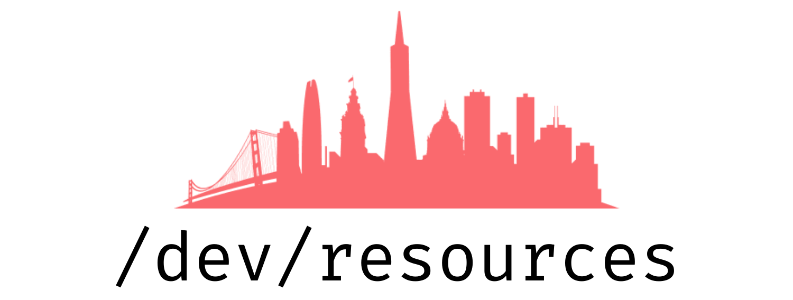

# opendev

  

---

## Technical

### Papers
* Chung, E. 2011. CoRAM: An in-fabric memory architecture for FPGA-based computing. Ph.D. thesis, Carnegie Mellon University.

### Blogs
* Statistical power and power analysis in Python. ([http](https://machinelearningmastery.com/statistical-power-and-power-analysis-in-python/))
* How Node works, part 1. ([http](https://medium.com/@igor.atakhanov/how-node-actually-works-part-1-the-operating-system-497fd0de8167), [ipfs](https://ipfs.io/ipfs/QmSQWYfmj1mkjvpfSLCgnbYBTDYx2bH8XaaNYmzSwhB2SA))
* Design docs at Google. ([http](https://www.industrialempathy.com/posts/design-docs-at-google/), [ipfs](https://ipfs.io/ipfs/QmRWkVEp2oDhGbDnpJWD3C6sA31nPSacerw8Yei1mV2jEd))
* What computer science majors should know. ([http](http://matt.might.net/articles/what-cs-majors-should-know/), [ipfs](https://ipfs.io/ipfs/QmTc3C48WDTJXPJSQ6RNKHyXK93apj8SymYNj86bcu7FwX))
* What every programmer should know about memory, part 1. ([http](https://lwn.net/Articles/250967/), [ipfs](https://ipfs.io/ipfs/QmNomYepjoBVk3S1sMRsbVZB3c4E2nct2QRPDq6BPsTh8H))
* Essays on programming I think about a lot. ([http](https://www.benkuhn.net/progessays/))
* _An introduction to Terraform._ ([http](https://blog.gruntwork.io/an-introduction-to-terraform-f17df9c6d180))

#### Heterogeneous computing
* **Faster parallel reductions on Kepler.** ([http](https://developer.nvidia.com/blog/faster-parallel-reductions-kepler/))

### Books
* Edward Tufte, **The Visual Design of Quantitative Information**.
* Eric Lengyel, **Mathematics for 3D Game Programming and Computer Graphics**.
* Peter Norvig and Stuart Russell, **Artificial Intelligence**.
* David Patterson and John Hennessy, **Computer Organization and Design**.
* Robert Love, **Linux Kernel Development**.

### Tutorials and guides
* Packaging Python projects ([http](https://packaging.python.org/tutorials/packaging-projects/))

---

## Non-technical

### Compilations
* **Y Combinator Startup Library.**
* **Y Combinator Essential Startup Advice.** ([http](https://www.ycombinator.com/library/4D-yc-s-essential-startup-advice))
* **Marc Andreessen's Startup Guide.** ([http](https://pmarchive.com/))
* **A guide to seed fundraising.** ([http](https://www.ycombinator.com/library/4A-a-guide-to-seed-fundraising))

### Blogs
* Matt Might, _How to email_. A primer on sending effective email messages. ([http](http://matt.might.net/articles/how-to-email/))

### Books

#### Tools
* Frank Mittelback and Michel Goossens, **The LaTeX Companion**. How to use LaTeX effectively.

#### Communication
* Justin Zobel, **Writing for Computer Science**.
* Joey Asher, **Even a Geek can Speak**.
* Florence Isaac, **Business Notes**. Guide to professional correspondence.
* Stephen King, **On Writing**.
* Roy Peter Clark, **Writing Tools**.
* Joshua Schimel, **Writing Science**.

---

## News outlets
* **The Markup.** ([http](https://themarkup.org/))

---

## Libraries and tools

### Infrastructure
* **`mozilla/sops`**: Secrets manager, encrypted files editor. ([github](https://github.com/mozilla/sops))
* **`dtan4/terraforming`**: Import AWS infrastructure into Terraform. ([http](http://terraforming.dtan4.net/), [github](https://github.com/dtan4/terraforming))

### Data visualization
* **Textures.js**: Texture generation library for D3. ([http](https://riccardoscalco.it/textures/))

### Machine learning
* **AmpliGraph**: Knowledge graph embeddings. ([github](https://github.com/Accenture/AmpliGraph))

### Computer aided design
* Gmsh: 3-dimensional finite element mesh generator.
